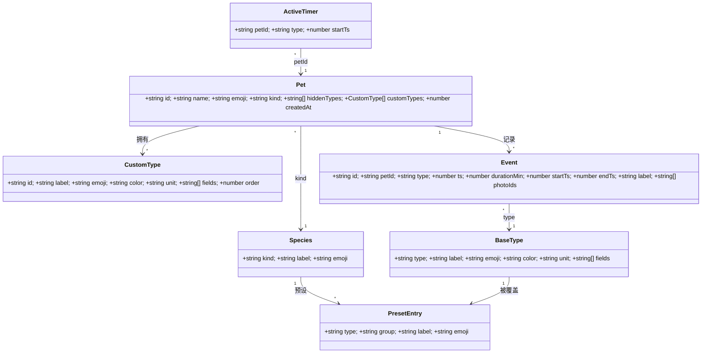

# 系统设计：按物种定制速记事件（宠物流水账日记 · 增量 v1.1）

| 项目 | 内容 |
| --- | --- |
| 文档类型 | 架构设计 + 任务分解（增量迭代） |
| Language | 简体中文 |
| 技术栈 | Vite 5 + React 18 + Tailwind 3（**无后端、无网络、零第三方运行时依赖**） |
| 项目路径 | `C:/Users/xxc/WorkBuddy/2026-09-07-09-50-46/pet-diary/` |
| 上游输入 | `docs/PRD-species-events.md`（PM 产出）+ 主理人 10 条拍板决策 |
| 关联任务 | team `software-petdiary-species` · Task #2 |
| 目标版本 | v1.1 |

> 本设计**已先读代码确认基线**（eventTypes.js / storage.js / format.js / App.jsx / 全部组件 / 全部 tests / package.json），所有函数名、props、key 前缀均与现有代码对齐。

---

## 1. 实现方案概览与关键取舍

### 1.1 核心技术挑战

| 挑战 | 说明 |
| --- | --- |
| **概念稳定 vs 物种贴合** | `type` 是写进历史记录的稳定键，绝不能因换物种而失效；但显示层要"狗=遛狗 / 猫=外出 / 鸟=遛鸟"。 |
| **老数据零丢失** | 老宠物（`kind` 仅 dog/cat/other）、老事件（未知 type）、老备份必须照常渲染与统计。 |
| **计时状态持久化** | 现状**完全没有计时器**，需新增"开始→结束→自动算时长"，且切走/重开仍继续。 |
| **老 `other` 用户按钮不消失** | v1.0 的 `kind:'other'` 用户看到全量 12 按钮，升级后不能凭空消失。 |
| **零依赖约束** | 不引 UI 库/路由/状态库/图表库，统计柱状图仍用纯 CSS。 |

### 1.2 分层方案（五层）

```
┌────────────────────────────────────────────────────────────┐
│ ⑤ 自定义层  pet.customTypes（仅 other 物种可新建，按宠物归属） │
├────────────────────────────────────────────────────────────┤
│ ④ 隐藏层    pet.hiddenTypes（按宠物裁剪预设，个体差异）        │
├────────────────────────────────────────────────────────────┤
│ ③ 覆盖层    SPECIES_PRESETS[kind] 条目的 label/emoji          │
│            （同 type 不同物种不同词；写死在预设条目，无 if-else）│
├────────────────────────────────────────────────────────────┤
│ ② 物种预设  SPECIES_PRESETS[kind]：可见集合 + 顺序 + 分组      │
├────────────────────────────────────────────────────────────┤
│ ① 基础池    BASE_TYPES：稳定概念键注册表（唯一 color/unit/fields）│
└────────────────────────────────────────────────────────────┘
```

**为什么这样分层（关键取舍）**：

| 决策 | 理由 |
| --- | --- |
| **基础池（BASE_TYPES）持有一切"与物种无关"的属性**（color / unit / fields） | `type` 语义唯一、单一来源；老数据渲染永远有兜底。 |
| **物种差异只体现在"预设条目"的 `{type,label,emoji,group}`** | 覆盖 = "同 type、不同声明"，无需运行时 if-else 补丁（PRD §3.4 建议）。 |
| **隐藏按 `petId`（决策 1）** | 与现有"选中一只宠物"（activePetId）心智模型一致，改动最小；能区分同种的两只猫。 |
| **自定义与预设同构（都产出 `{type,label,emoji,color,unit,fields}`）** | union 后统一排序、统一渲染，QuickLog/EventEditor 不需区分来源。 |
| **计时会话独立 key** | 与 pets/events 解耦，切走重开可恢复；全局单会话（决策 4）。 |
| **事件写 `label` 快照** | 删除自定义后历史仍能显示原名，而非降级为"备注"（PRD §4.3）。 |
| **不拆分 `eventTypes.js`（保持单文件）** | 应用规模小，拆分会产生 re-export 图与循环依赖风险；单文件 `import` 图零变更，现有 `from './eventTypes.js'` 全部继续可用。 |

### 1.3 架构模式

沿用现有 **"单页容器 + 受控子组件 + `src/lib` 纯函数/持久化层"** 结构（无路由、无全局状态库）。派生数据用 `useMemo` 从 localStorage 读到的原始数据计算；持久化统一走 `storage.js`。

---

## 2. 数据模型变更

### 2.1 宠物对象（localStorage `petlog.v1.pets`）

```ts
type PetKind = 'dog'|'cat'|'rabbit'|'bird'|'fish'|'rodent'|'reptile'|'other';

interface CustomType {
  id: string;        // 'custom_xxxxxxxx'，保证不与任何基础 type 冲突
  label: string;     // 1..6 字符（中文约 6 字），trim 后非空
  emoji: string;     // 默认 '⭐'
  color: string;     // 取自 CUSTOM_COLOR_OPTIONS 的完整 Tailwind 类字符串（静态字面量）
  unit: string;      // 默认 ''
  fields: string[];  // ⊆ ['durationMin','note']，默认 ['note']
  order: number;     // 创建序号（Date.now()），用于稳定排序
}

interface Pet {
  id: string;
  name: string;
  emoji: string;          // 宠物头像 emoji（新建时默认=物种 emoji，可改）
  kind: PetKind;          // ← 由 3 枚举扩为 8 枚举
  hiddenTypes: string[];  // ← 新增：被隐藏的 type / 自定义 id（按宠物）
  customTypes: CustomType[]; // ← 新增：该宠物的自定义事件（仅 other 物种会新建）
  createdAt: number;
}
```

**新增/变更字段**：`kind` 白名单扩为 8；新增 `hiddenTypes`、`customTypes`。

### 2.2 `sanitizePet` 清洗规则（storage.js）

| 字段 | 规则 |
| --- | --- |
| `kind` | `SPECIES_KINDS.includes(item.kind) ? item.kind : 'other'`（老 `dog/cat/other` 原样保留，非法/缺失 → `other`） |
| `hiddenTypes` | `Array.isArray ? 去重后的字符串数组 : []`（去重、丢弃非字符串） |
| `customTypes` | `Array.isArray ? map(sanitizeCustomType).filter(Boolean) : []` |
| `emoji` | 保持现有：非空字符串，否则 `'🐾'` |
| 其余 | 保持现有（`id`/`name`/`createdAt`） |

`sanitizeCustomType(item)`：`id` 非空字符串且**不属于基础 type**，否则 `custom_${newId()}`；`label` trim 非空否则 `'自定义'`；`emoji` 非空否则 `'⭐'`；`color` 属于 `CUSTOM_COLOR_OPTIONS` 否则取第 0 项；`unit` 字符串否则 `''`；`fields` 取 `['durationMin','note']` 交集，空则 `['note']`；`order` 有限数否则 `Date.now()`。

### 2.3 计时会话（新 key）

```js
KEYS.activeTimer = 'petlog.v1.activeTimer';   // 值：{ petId, type, startTs } | null
```

**读写封装函数（新增于 storage.js）**：

```js
/**
 * 读取进行中的计时会话（清洗：字段非法返回 null）
 * @returns {{petId:string, type:string, startTs:number} | null}
 */
export function readActiveTimer()

/**
 * 写入/覆盖计时会话
 * @param {{petId:string,type:string,startTs:number}|null} session
 * @returns {boolean}
 */
export function writeActiveTimer(session)

/**
 * 开始计时（全局单会话：覆盖已有会话），默认 startTs = now
 * @returns {{petId:string,type:string,startTs:number}}
 */
export function startTimer(petId, type, startTs = Date.now())

/** 结束/取消计时（写入 null） @returns {boolean} */
export function clearTimer()
```

- **全局单会话**（决策 4）：`startTimer` 直接覆盖，`App` 检测到已有会话时给一次 toast 提醒。
- `clearAll` 已遍历 `Object.keys(KEYS)`，**自动包含** `activeTimer`，无需额外改动。
- `estimateStorageBytes` 同理自动纳入。

### 2.4 事件对象（localStorage `petlog.v1.events`）

**新增可选字段**（`startTs` / `endTs` / `label`）：

```ts
interface Event {
  id: string; petId: string; type: string; ts: number;
  note: string; amount: number|null; unit: string;
  poopForm: string; poopColor: string;
  durationMin: number|null;   // 权威统计值：时长（分钟，允许小数，如 12.5）
  startTs: number|null;       // ← 新增：计时事件开始时间（老事件 null）
  endTs:   number|null;       // ← 新增：计时事件结束时间（老事件 null）
  label:   string;            // ← 新增：展示名快照（自定义/未知类型写入，老事件 ''）
  photoIds: string[]; createdAt: number; updatedAt: number;
}
```

**取舍**：
- `durationMin` 仍是统计的**唯一权威值**（`ts` = 开始时刻，不影响时间轴排序）。`startTs/endTs` 仅供未来"12:00–12:30"区间展示，可空。
- `label` 快照使"删除自定义事件后历史仍显示原名"成为可能（PRD §4.3）。
- `sanitizeEvent` 对三者做兼容：非法/缺失 → `startTs/endTs = null`、`label = ''`；老事件天然满足。

### 2.5 导入导出

| 项 | 决定 | 向后兼容策略 |
| --- | --- | --- |
| `hiddenTypes` / `customTypes` | **随 pets 一起导出/导入**（本就是 pet 字段，`sanitizePet` 自动处理） | 老备份无这些字段 → `[]` 补齐 |
| `activeTimer` | **导出携带**（`exportData` 增加 `activeTimer: readActiveTimer()`）；**overwrite 导入时恢复**（缺失/非法 → `null`）；**merge 导入不动本地 timer**（会话是瞬时态） | 老备份无该字段 → overwrite 置 `null`，merge 忽略 |
| `version` | **保持 `1`**（本次为**纯增量**：只加字段、不改语义；`validateImport` 也未对 version 设门槛） | 老/新备份互认；`tests/storage.test.js` 中 `version===1` 断言无需改 |

---

## 3. 模块与文件清单

### 3.1 新增文件

| 文件（相对路径） | 职责（一句话） |
| --- | --- |
| `src/components/TimerBar.jsx` | 记录页顶部"计时进行中"横幅：显示物种化事件名 + 实时已用时长 + "结束"按钮。 |
| `src/components/EventManager.jsx` | 设置页"事件管理"区块：按宠物列出预设（基础/专属分组）的显示/隐藏开关、自定义事件 CRUD、"恢复默认"。 |
| `tests/timer.test.js` | 计时会话读写/持久化/覆盖/清洗 的单元测试（新增）。 |

### 3.2 修改文件

| 文件 | 改动概要 |
| --- | --- |
| `src/lib/eventTypes.js` | **核心重构**：新增 `SPECIES`/`BASE_TYPES`/`SPECIES_PRESETS` 三层 + 解析/过滤/计时/统计函数；`EVENT_TYPES` 保留为 `BASE_TYPES` 别名。 |
| `src/lib/storage.js` | `sanitizePet`（8 kind + hiddenTypes + customTypes）、`sanitizeEvent`（startTs/endTs/label）、`KEYS.activeTimer`、计时函数、`exportData/importData` 携带 timer。 |
| `src/lib/format.js` | 新增 `formatDuration(minutes)`、`formatClockRange(startTs,endTs)`。 |
| `src/App.jsx` | 装配：可见类型计算、计时状态与恢复、隐藏/自定义回调、物种化 props 下传。 |
| `src/components/QuickLog.jsx` | 渲染物种化可见集；计时类按钮加 ⏱ 标识与开始/结束态。 |
| `src/components/EventEditor.jsx` | 类型网格按物种过滤（并保留当前被编辑的老类型可选）；支持自定义类型。 |
| `src/components/Timeline.jsx` | 用 `resolveEventDisplay(event, pet)` 取物种化 label/emoji（含"已删除自定义"快照兜底）。 |
| `src/components/StatsView.jsx` | 去硬编码：按 `getStatsMetrics(kind)` 动态选指标 + 新增"本周外出总时长"。 |
| `src/components/SettingsView.jsx` | `KIND_OPTIONS` → 8 物种 chips；选物种自动带出默认头像；换物种提醒；嵌入 `<EventManager>`。 |
| `src/components/DaySummary.jsx` | 基本不变（App 传入的 `counts` 改为按物种可见集生成）。 |
| `tests/eventTypes.test.js` | 改造：去掉 `length===12`，改为"含全部 legacy 12 + 语义稳定 + 未知兜底 + 新解析函数"。 |
| `tests/eventTypes.increment.test.js` | 改造：`play/cuddle` 断言保留，`length===12` 改为"preset 内存在"。 |
| `tests/eventTypes.order.render.test.js` | 改造：以 **dog preset** 顺序为准（`其他`→`备注`，`拉屎` 等）。 |
| `tests/app.render.test.js` | 改造：`其他`→`备注`；补物种化断言（猫渲染"外出/便便"）。 |
| `tests/storage.test.js` | 改造：`KEYS` 断言加 `activeTimer`；补 `hiddenTypes/customTypes` 清洗与计时函数用例。 |
| `tests/stats.render.test.js` | 小改：`StatsView` 传入 `pet`（保持 `petName` 兼容）。 |

> **无需改动**：`PetSwitcher.jsx`、`PhotoStrip.jsx`、`photoStore.js`、`tests/photo*.test.js`、`tests/format.test.js`（`formatDuration` 为纯新增）。

### 3.3 `eventTypes.js` 重构后的导出接口（契约）

```js
// ---------- 物种 ----------
export const SPECIES;            // [{kind,label,emoji}] × 8，顺序即物种选择器顺序
export const SPECIES_KINDS;      // string[]，用于 sanitizePet 白名单
export function getSpecies(kind);   // → species 对象（未知兜底 other）
export function speciesEmoji(kind); // → species.emoji（新建宠物默认头像用）

// ---------- 基础池（概念注册表） ----------
export const BASE_TYPES;   // [{type,label,emoji,color,unit,fields}]，含全部稳定 type
export const TYPE_ORDER;   // string[]，规范顺序（预设缺失时的排序依据）
export const EVENT_TYPES;  // = BASE_TYPES（向后兼容别名，历史命名）
export function getEventType(type);   // 基础元数据；未知兜底 other（保持旧契约，供 sanitize/describe 使用）
export function hasField(type, field);

// ---------- 物种预设 + 覆盖 + 过滤 ----------
export const SPECIES_PRESETS;         // { [kind]: [{type,group,label,emoji}] }（label/emoji 即该物种展示值）
export function getPresetEventTypes(kind);   // → 合并 base 后的预设元数据数组（含 group）
export function resolveEventMeta(type, pet); // → 单个 type 的展示元数据（自定义 → 预设覆盖 → 基础 → 兜底）
export function resolveEventDisplay(event, pet); // → 事件的展示元数据（额外支持 label 快照兜底）
export function getVisibleEventTypes(pet);   // → 可见事件列表（预设 − hidden + custom 追加）

// ---------- 计时 ----------
export const TIMER_TYPES;            // ['walk','flight']（决策 3）
export function isTimerType(type);   // → boolean

// ---------- 统计 ----------
export function getStatsMetrics(kind); // → { bars, intervals, durationTypes, hasPoop, available }

// ---------- 自定义 ----------
export const CUSTOM_COLOR_OPTIONS;   // 完整 Tailwind 类字符串数组（静态，供扫描）
export const CUSTOM_FIELD_OPTIONS;   // ['durationMin','note']

// ---------- 描述（保持既有契约） ----------
export const POOP_FORMS, POOP_COLORS;
export function describeEvent(event);  // 时长段改用 formatDuration()
```

**`SPECIES`（8 物种，`other` 默认 emoji 用 🐾 —— 决策 9）**

| kind | label | emoji |
| --- | --- | --- |
| dog | 狗 | 🐕 |
| cat | 猫 | 🐈 |
| rabbit | 兔 | 🐇 |
| bird | 鸟 | 🐦 |
| fish | 鱼 | 🐠 |
| rodent | 鼠 | 🐹 |
| reptile | 爬宠 | 🦎 |
| other | 其他 | 🐾 |

**`BASE_TYPES`（概念注册表；`color` 为完整 Tailwind 类字符串，严格遵守"不可拼接"约束）**

| type | 默认 label | emoji | color | unit | fields | group |
| --- | --- | --- | --- | --- | --- | --- |
| walk | 外出 | 🚶 | `bg-emerald-100 text-emerald-700` | min | durationMin | base |
| meal | 吃饭 | 🍚 | `bg-amber-100 text-amber-700` | g | amount | base |
| treat | 零食 | 🦴 | `bg-orange-100 text-orange-700` | 个 | amount | base |
| water | 喝水 | 💧 | `bg-sky-100 text-sky-700` | | | base |
| poop | 便便 | 💩 | `bg-yellow-100 text-yellow-800` | | poopForm,poopColor | base |
| pee | 尿尿 | 💦 | `bg-cyan-100 text-cyan-700` | | | base |
| play | 玩耍 | 🎾 | `bg-teal-100 text-teal-700` | min | durationMin | base |
| cuddle | 摸摸 | 🤚 | `bg-pink-100 text-pink-700` | | | base |
| bath | 洗澡 | 🛁 | `bg-indigo-100 text-indigo-700` | | | base |
| med | 吃药 | 💊 | `bg-rose-100 text-rose-700` | | note | base |
| weight | 体重 | ⚖️ | `bg-violet-100 text-violet-700` | kg | amount | base |
| other | 备注 | 📝 | `bg-stone-100 text-stone-700` | | note | base |
| flight | 出笼飞 | 🕊️ | `bg-sky-100 text-sky-700` | min | durationMin | special |
| sunbask | 晒太阳/晒灯 | ☀️ | `bg-amber-100 text-amber-700` | min | durationMin | special |
| nailTrim | 剪指甲 | ✂️ | `bg-slate-100 text-slate-700` | | | special |
| clean | 清理容器 | 🧽 | `bg-lime-100 text-lime-700` | | note | special |
| waterChange | 换水 | 🚰 | `bg-blue-100 text-blue-700` | | note | special |
| topWater | 加水 | 💧 | `bg-sky-100 text-sky-700` | | | special |
| testWater | 测水质 | 🧪 | `bg-cyan-100 text-cyan-700` | | note | special |
| observe | 观察异常 | 👀 | `bg-slate-100 text-slate-700` | | note | special |
| soakMist | 泡水/喷水 | 💦 | `bg-cyan-100 text-cyan-700` | | note | special |
| shed | 蜕皮 | 🐍 | `bg-emerald-100 text-emerald-700` | | note | special |
| custom | 自定义 | ⭐ | `bg-stone-100 text-stone-700` | | note | special |

**`SPECIES_PRESETS`（物种 → 覆盖表；label/emoji 即最终展示值，`—` 表示该物种不含此 type）**

| type | dog | cat | rabbit | bird | fish | rodent | reptile | other |
| --- | --- | --- | --- | --- | --- | --- | --- | --- |
| walk | 遛狗🐕 | 外出🐈 | 放风🐇 | 遛鸟🐦 | — | 放风🐹 | — | 外出🚶 |
| flight | — | — | — | 出笼飞🕊️ | — | — | — | — |
| meal | 吃饭🍚 | 吃饭🍚 | 吃饭🍚 | 吃饭🍚 | 喂食🍚 | 喂食🍚 | 喂食🍚 | 吃饭🍚 |
| treat | 零食🦴 | 零食🦴 | — | — | — | — | — | 零食🦴 |
| water | 喝水💧 | 喝水💧 | 喝水💧 | 喝水💧 | — | 喝水💧 | — | 喝水💧 |
| poop | 拉屎💩 | 便便💩 | 便便💩 | 便便💩 | — | 便便💩 | 便便💩 | 便便💩 |
| pee | 尿尿💦 | 尿尿💦 | 尿尿💦 | — | — | — | — | 尿尿💦 |
| play | 玩耍🎾 | 逗猫棒🪶 | — | — | — | — | — | 玩耍🎾 |
| cuddle | 摸摸🤚 | 摸摸🤚 | 摸摸🤚 | 上手🤚 | — | 互动🤚 | 上手互动🤚 | 摸摸🤚 |
| bath | 洗澡🛁 | 洗澡🛁 | — | 鸟浴🛁 | — | 浴沙🏖️ | — | 洗澡🛁 |
| med | 吃药💊 | 吃药💊 | 吃药💊 | 吃药💊 | 用药💊 | 吃药💊 | 吃药💊 | 吃药💊 |
| weight | 体重⚖️ | 体重⚖️ | 体重⚖️ | 体重⚖️ | — | 体重⚖️ | 体重⚖️ | 体重⚖️ |
| nailTrim | — | 剪指甲✂️ | 剪指甲✂️ | — | — | — | — | — |
| clean | — | — | — | — | 清缸🧽 | 换垫料🧺 | 清理饲养箱🧽 | — |
| waterChange | — | — | — | — | 换水🚰 | — | — | — |
| topWater | — | — | — | — | 加水💧 | — | — | — |
| testWater | — | — | — | — | 测水质🧪 | — | — | — |
| observe | — | — | — | — | 观察异常👀 | — | — | — |
| soakMist | — | — | — | — | — | — | 泡水/喷水💦 | — |
| sunbask | — | — | — | — | — | — | 晒太阳/晒灯☀️ | — |
| shed | — | — | — | — | — | — | 蜕皮🐍 | — |
| other | 备注📝 | — | 备注📝 | 备注📝 | — | 备注📝 | 备注📝 | 备注📝 |

> **`other` 物种预设 = v1.0 的 legacy 12 类**（决策 7A：保留通用池兜底，老用户按钮不消失），label 取基础池默认值。
> 相对 v1.0 有 3 处**用词微调**（非删除）：`遛狗→外出`、`拉屎→便便`、`其他→备注`。已列入 §10 待确认，若需完全冻结可回退为 legacy 文案。

**展示顺序约定**：物种预设内**按其矩阵声明顺序**；自定义事件**追加在末尾**（`customTypes` 按 `order` 升序）。

---

## 4. 关键数据结构与接口

- **类图**：见 `docs/class-diagram.mermaid`（同时内嵌如下）。
- **时序图**：见 `docs/sequence-diagram.mermaid`。



**核心函数签名（伪代码契约）**

```js
// 可见事件列表：预设(按矩阵顺序) − hidden + 自定义(追加末尾)
function getVisibleEventTypes(pet) {
  const hidden = new Set(pet.hiddenTypes || []);
  const preset = getPresetEventTypes(pet.kind).filter((m) => !hidden.has(m.type));
  const customs = (pet.customTypes || [])
    .filter((c) => !hidden.has(c.id))
    .sort((a, b) => a.order - b.order)
    .map((c) => ({ type: c.id, label: c.label, emoji: c.emoji, color: c.color,
                   unit: c.unit || '', fields: c.fields || ['note'],
                   group: 'custom', isCustom: true }));
  return [...preset, ...customs];
}

// 单 type 展示元数据（用于类型网格/按钮，无 event 上下文）
function resolveEventMeta(type, pet) {
  const ct = (pet?.customTypes || []).find((c) => c.id === type);
  if (ct) return { type: ct.id, label: ct.label, emoji: ct.emoji, color: ct.color,
                   unit: ct.unit || '', fields: ct.fields || ['note'], group: 'custom', isCustom: true };
  const base = BASE_INDEX[type];
  const ov = (SPECIES_PRESETS[pet?.kind] || []).find((e) => e.type === type);
  if (base || ov) {
    const b = base || BASE_INDEX.other;
    return { ...b, label: ov ? ov.label : b.label, emoji: ov ? ov.emoji : b.emoji, group: ov ? ov.group : 'base' };
  }
  return { ...BASE_INDEX.other }; // 未知 type 兜底
}

// 事件展示元数据（多一层 label 快照兜底：删除自定义后仍显示原名）
function resolveEventDisplay(event, pet) {
  const ct = (pet?.customTypes || []).find((c) => c.id === event.type);
  if (ct) return { label: ct.label, emoji: ct.emoji, color: ct.color };
  const base = BASE_INDEX[event.type];
  const ov = (SPECIES_PRESETS[pet?.kind] || []).find((e) => e.type === event.type);
  if (base || ov) return { label: ov ? ov.label : base.label, emoji: ov ? ov.emoji : base.emoji, color: base.color };
  return { label: event.label || '已删除的自定义事件', emoji: '⭐', color: CUSTOM_COLOR_OPTIONS[0] };
}

// 计时
const TIMER_TYPES = ['walk', 'flight'];              // 决策 3
function isTimerType(type) { return TIMER_TYPES.includes(type); }

// 统计指标（按优先级 ∩ 该物种可见集）
const STATS_PRIORITY = ['walk','flight','meal','poop','water','clean','waterChange','play','sunbask','cuddle','med','testWater'];
function getStatsMetrics(kind) {
  const available = new Set(getPresetEventTypes(kind).map((m) => m.type));
  const bars = STATS_PRIORITY.filter((t) => available.has(t)).slice(0, 3);
  const durationTypes = TIMER_TYPES.filter((t) => available.has(t));
  return { bars, intervals: bars, durationTypes, hasPoop: available.has('poop'), available };
}
```

---

## 5. 程序调用流程（时序图）

完整时序图见 `docs/sequence-diagram.mermaid`。覆盖四类关键流程：

**(a) 新建宠物选物种 → 速记区按物种过滤**
`SettingsView` 选物种 → `speciesEmoji` 带出默认头像 → `storage.addPet`（`sanitizePet` 补 `hiddenTypes/customTypes`）→ `eventTypes.getVisibleEventTypes(pet)` → `QuickLog` 渲染猫贴合集。

**(b) 计时：开始 → 持久化 → 重开恢复 → 结束生成记录**
`QuickLog ⏱` → `App.onStartTimer` → `storage.startTimer`（落 `petlog.v1.activeTimer`）→ `TimerBar` 显示 → *切走/重开* → `App` 初始化 `readActiveTimer()` 恢复 → `结束` → `clearTimer` + `addEvent({ts:startTs,startTs,endTs,durationMin})` → `Timeline` 出现带时长记录。

**(c) 隐藏 / 自定义事件**
隐藏 → `onUpdatePet({hiddenTypes})` → `getVisibleEventTypes` 少一项；自定义（仅 other）→ `onUpdatePet({customTypes})` → union 追加；记录自定义时写 `label` 快照；删除自定义 → 仅删定义，历史经 `resolveEventDisplay` 用快照显示原名。

**(d) 统计页按物种动态计算（含"外出/放风总时长"）**
`getStatsMetrics(kind)` 取指标 → `StatsView` 按物种聚合 7 天柱状 + 间隔卡；`durationMin` 求和得"本周外出总时长"；无对应事件的物种自动隐藏卡片（如鱼无"便便/外出"）。

---

## 6. 任务列表（有序 · 依赖 · 验收）

> **拆分原则**：≤5 个任务；每任务 ≥3 个相关文件；按"数据层 → 组件层 → 集成"分组。T01 为增量场景下的"基础设施层"（本项目无新增依赖与构建配置变更，故基础设施=领域与数据层）。

### T01 · 领域与数据层（基础库重构）
- **涉及文件**：`src/lib/eventTypes.js`、`src/lib/storage.js`、`src/lib/format.js`；测试：`tests/eventTypes.test.js`、`tests/eventTypes.increment.test.js`、`tests/storage.test.js`
- **依赖**：无 · **优先级**：P0
- **验收要点**：
  - `EVENT_TYPES`（= `BASE_TYPES`）含全部 legacy 12 个 type 且语义不变；`getEventType` 未知兜底 `other` 仍成立。
  - `SPECIES`（8）/`getSpecies`/`speciesEmoji`；`getPresetEventTypes`/`getVisibleEventTypes`/`resolveEventMeta`/`resolveEventDisplay`/`isTimerType`/`getStatsMetrics` 全部到位且与 §3.3 契约一致。
  - `sanitizePet` 支持 8 kind + `hiddenTypes` + `customTypes`；老 `dog/cat/other` 原样保留，非法 → `other`。
  - `sanitizeEvent` 兼容 `startTs/endTs/label`（老事件 → `null/null/''`）。
  - `KEYS.activeTimer` + `readActiveTimer/startTimer/clearTimer`；`clearAll`/`estimateStorageBytes` 自动覆盖新 key。
  - `formatDuration`：`<1→不到 1 分钟`、`30→30 分钟`、`90→1 小时 30 分钟`；`describeEvent` 时长段改用之，且旧断言（`'30 分钟'`）仍通过。
  - `exportData` 输出含 `activeTimer`；`importData` overwrite 恢复 timer、merge 不动；`version` 保持 `1`。
  - 改造后的 lib 单测：删除 `length===12` 与固定顺序断言，改为"legacy 12 存在 + 语义稳定 + 新函数行为 + 计时清洗"。

### T02 · 物种化速记 / 编辑 / 时间轴
- **涉及文件**：`src/components/QuickLog.jsx`、`src/components/EventEditor.jsx`、`src/components/Timeline.jsx`、`src/components/DaySummary.jsx`(如需)、`src/App.jsx`(装配)；测试：`tests/eventTypes.order.render.test.js`、`tests/app.render.test.js`
- **依赖**：T01 · **优先级**：P0
- **验收要点**：
  - `QuickLog` 渲染 `getVisibleEventTypes(activePet)`；dog 渲染"遛狗/拉屎"，cat 渲染"外出/便便/逗猫棒/剪指甲"。
  - `EventEditor` 类型网格按物种过滤；**被编辑的老事件 type 若不在当前物种集内，仍保留为可选项**（避免"打开老记录类型被吞"）。
  - `Timeline` 用 `resolveEventDisplay(event, pet)` 取 label/emoji；自定义/已删除自定义不白屏。
  - `DaySummary` 的 `counts` 由 App 按物种可见集生成（顺序随矩阵）。
  - 记录自定义事件时写入 `label` 快照。
  - 渲染测试改为以 dog preset 为准（`其他`→`备注`），并补"猫/鱼渲染正确"断言。

### T03 · 计时器与时长泛化（P1 全量落地）
- **涉及文件**：`src/components/TimerBar.jsx`(新)、`src/components/QuickLog.jsx`(计时按钮分支)、`src/App.jsx`(计时状态/持久化/恢复)、`src/lib/storage.js`(如需要微调)；测试：`tests/timer.test.js`(新)
- **依赖**：T01、T02 · **优先级**：P1
- **验收要点**：
  - `isTimerType` = `walk`/`flight`；仅这些按钮显示 ⏱ 且进入"开始/结束"交互（`play`/`sunbask` 仍手填分钟，无计时按钮）。
  - 开始 → 落 `petlog.v1.activeTimer`；`TimerBar` 显示物种化事件名 + 实时已用时长。
  - 模拟"重开"：`readActiveTimer()` 能恢复；`petId` 已失效（宠物被删）→ 自动 `clearTimer()`。
  - 结束 → `clearTimer()` + 写入 `{ts:startTs,startTs,endTs,durationMin}`（`durationMin= round((end-start)/60000, 1)`）。
  - 全局单会话：已有会话时再点开始 → 提醒并覆盖。
  - 单测覆盖：读写/覆盖/清洗/删除宠物后恢复清理。

### T04 · 事件管理（隐藏 / 自定义）与设置页
- **涉及文件**：`src/components/EventManager.jsx`(新)、`src/components/SettingsView.jsx`、`src/App.jsx`(回调)
- **依赖**：T01 · **优先级**：P1
- **验收要点**：
  - `SettingsView` 物种选择器 = 8 项带 emoji chips；新建宠物选物种后**头像默认=物种 emoji**，仍可改。
  - 换物种：`hiddenTypes` 重置为 `[]`，`customTypes` 与历史保留，**切换前弹提醒**（决策 10）。
  - `EventManager`：按宠物列出预设（基础/专属分组）+ 显示/隐藏开关；"恢复默认"清空 `hiddenTypes`。
  - 自定义事件（**仅 other 物种**）：新建（emoji + 名字 1–6 字 + 颜色 + 时长开关）/编辑/删除；同宠物内不重名；颜色取自 `CUSTOM_COLOR_OPTIONS`（完整类字符串）。
  - 删除自定义仅删定义，不级联删历史（决策 6）。

### T05 · 物种化统计与集成联调
- **涉及文件**：`src/components/StatsView.jsx`、`src/App.jsx`(统计 props)、`tests/stats.render.test.js`；配套：`tests/app.render.test.js` 增补回归
- **依赖**：T01、T02、T03、T04 · **优先级**：P1
- **验收要点**：
  - `StatsView` 去硬编码：柱状图/间隔卡按 `getStatsMetrics(kind)` 动态生成；卡片文案随物种变化（狗"遛狗"、猫"外出"…）。
  - 新增"本周外出总时长"（`Σ durationMin` over walk/flight，近 7 天）+ "最近一次外出时长"，`formatDuration` 展示。
  - 无对应事件的物种自动隐藏卡片（鱼无"便便/外出" → 显示"距上次换水"类指标）。
  - 保持 `petName` prop 兼容（旧渲染测试仍绿）。
  - 全量回归：`npm test` 全绿；手工冒烟：新建 4 类物种宠物 + 计时恢复 + 导入导出闭环。

---

## 7. 依赖包

**结论：本次无需新增任何依赖。**

| 类别 | 结论 |
| --- | --- |
| 运行时依赖 | 维持 `react` / `react-dom`（零第三方运行时依赖原则不变）。 |
| 构建/样式 | 维持 `vite`/`@vitejs/plugin-react`/`tailwindcss`/`postcss`/`autoprefixer`。 |
| 测试 | 维持 Node 内置 `node --test`；`fake-indexeddb` 已有可复用（图片相关用例）。计时会话是 localStorage（同步），无需新测试库。 |

---

## 8. 共享知识 / 跨文件约定

| 主题 | 约定 |
| --- | --- |
| **颜色（Tailwind）** | 一律使用**完整类字符串**（如 `bg-emerald-100 text-emerald-700`），**严禁字符串拼接**（如 `bg-${c}-100` 扫描不到）。新增 type / 自定义色板必须写成源码字面量（放在 `eventTypes.js`）。 |
| **label 覆盖表位置** | 唯一来源 = `eventTypes.js` 的 `SPECIES_PRESETS`（条目直接写 `label/emoji`）。组件**不得**写 `if (kind==='cat')` 之类的分支。 |
| **type 稳定性** | `type` 是持久化概念键，**不删、不复用为别义**；物种差异只走"预设裁剪 + label/emoji 覆盖"。 |
| **计时 label 动态生成** | `TimerBar` 用 `resolveEventMeta(type, pet).label`（如猫的 walk 显示"外出"），不写死。 |
| **隐藏/自定义 union 排序** | 预设按矩阵顺序在前；自定义按 `customTypes[].order` 升序**追加末尾**。 |
| **时长口径** | `durationMin` 存 `number`（允许小数）；展示统一走 `formatDuration()`（取整到分钟）；统计按分钟求和。 |
| **App.jsx 是集成枢纽** | T02 建立 props 传递骨架；T03/T04/T05 在同一文件**追加互不重叠的差分片**（timer state / 事件管理回调 / 统计 props）。任务顺序执行，避免冲突。 |
| **旧测试改造** | ① `eventTypes*.test.js`：删 `length===12` 与固定顺序断言 → 改"legacy 12 存在 + 语义稳定"；② `eventTypes.order.render.test.js` / `app.render.test.js`：以 **dog preset** 为准（`其他`→`备注`，`拉屎` 等）；③ `storage.test.js`：`KEYS` 断言加 `activeTimer`；④ `stats.render.test.js`：传入新增 `pet`。 |
| **持久化纪律** | 一切 localStorage 读写必须经 `storage.js`（含新 `activeTimer`），沿用 `try/catch + 清洗 + 错误监听`。 |

---

## 9. 风险与向后兼容清单

| # | 边界场景 | 处理策略 |
| --- | --- | --- |
| 1 | 老宠物无 `hiddenTypes/customTypes` | `sanitizePet` 补 `[]`；渲染默认全显示。 |
| 2 | 老 `kind`（dog/cat/other） | `dog→dog`、`cat→cat`、`other→other`；`other` 预设=legacy 12，按钮不消失。 |
| 3 | 非法/缺失 `kind` | 兜底 `other`（沿用现策略）。 |
| 4 | 老事件无 `startTs/endTs/label` | `sanitizeEvent` 补 `null/null/''`；渲染与统计不受影响。 |
| 5 | 未知 type（脏数据） | `getEventType`/`resolveEventMeta`/`resolveEventDisplay` 三级兜底，绝不白屏（保持现有稳健行为）。 |
| 6 | 自定义事件被删除 | 保留历史；`resolveEventDisplay` 用 `event.label` 快照显示原名，无快照则"已删除的自定义事件"。 |
| 7 | 隐藏了一个"历史里已记录过"的 type | 仅从速记/编辑**选项**移除，**历史记录照常显示**（不因隐藏而消失）。 |
| 8 | 删除宠物 | 现有逻辑连带删其 events + 照片；`customTypes` 随 pet 一并消失；若 `activeTimer.petId` 指向被删宠物 → App 自动 `clearTimer()`。 |
| 9 | 计时会话指向已删宠物 / 脏数据 | `readActiveTimer` 清洗非法值→`null`；App 启动与切宠物时校验 `petId` 是否存在，失效即清。 |
| 10 | 计时中的 type 被隐藏或换物种后不可见 | `TimerBar` 仍能显示（用 `resolveEventMeta` 取名）并可"结束"，保证会话可正常收尾。 |
| 11 | 换物种 | `hiddenTypes` 重置、`customTypes` 保留、历史保留；切换前提醒（决策 10）。 |
| 12 | 老备份导入（缺 `hiddenTypes/customTypes/activeTimer`） | 不报错：pets 用默认补齐；overwrite 时 timer 置 `null`，merge 不动本地 timer。 |
| 13 | 自定义事件 id 与基础 type 撞名 | `sanitizeCustomType` 检测到与基础 type 冲突则重新生成 `custom_*` id。 |
| 14 | localStorage 配额 | 新增数据极小（几个短字符串数组），无实质影响；沿用配额错误 toast。 |
| 15 | `other` 物种用词微调 | `遛狗→外出`、`拉屎→便便`、`其他→备注`（非删除，按钮数不变）；见 §10。 |
| 16 | Tailwind 扫描遗漏新色 | 所有新 color 写入 `eventTypes.js` 字面量；`CustomType.color` 取自 `CUSTOM_COLOR_OPTIONS`。 |
| 17 | `stats.render.test.js` props 变更 | `StatsView` 保留 `petName`，`pet/kind` 为可选（缺省 `dog`），旧用例不破。 |

---

## 10. 待明确事项

> 主理人 10 条决策已全部采纳，不再作为开放问题。以下为设计过程中衍生的**微决策**，默认按设计执行，主理人/用户可一键否决：

1. **`other` 物种的 legacy 文案微调**：为回应"标签不别扭"与 PRD §3.2 默认值，`other` 物种的 `walk→外出`、`poop→便便`、`other→备注`（v1.0 为 `遛狗/拉屎/其他`）。**按钮数量与集合完全不变**（12 个），仅 3 处用词更中性。若要求"老 other 用户所见一字不改"，回退这 3 项文案即可（改 `SPECIES_PRESETS.other` 一个数组）。
2. **`other` 物种是否显示"物种 emoji = 🐾 还是 ❓"**：按决策 9 采用 🐾（PRD §2 原为 ❓）。
3. **`version` 保持 `1`**：因本次为纯增量（只加字段、不改语义），选择不 bump 以兼容既有 `version===1` 断言。若团队规范要求版本号递增，改为 `2` 并同步 `tests/storage.test.js`。
4. **计时结束后的 `ts` 语义**：本设计取 `ts = startTs`（事件落在开始时刻，时间轴排序自然）；如需落在结束时刻，改为 `ts = endTs`。
5. **自定义事件"是否计时"默认值**：默认 `fields=['note']`（不启用手填时长），用户可勾选后加 `durationMin`。若希望默认即可填时长，改 `CUSTOM_FIELD_OPTIONS` 默认集合。
